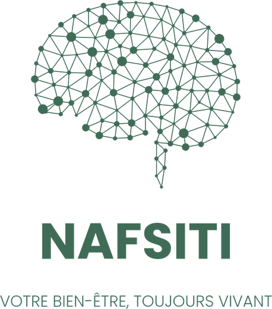
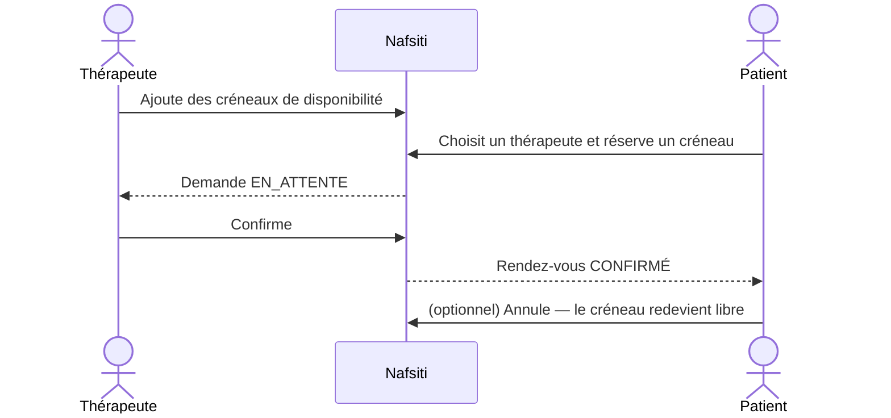

<p align="center">
  
</p>

<h1 align="center">NAFSITI — Plateforme de santé mentale</h1>

<p align="center">
  
  
  
  
  
  
</p>

Nafsiti (« ma psyché ») met en relation **patients** et **thérapeutes** : prise de rendez-vous en ligne, suivi des séances et espace d'administration de la plateforme.

- **Backend** : API REST Spring Boot sécurisée par JWT — [`nefsiti_back/`](nefsiti_back)
- **Frontend** : application Angular — [`nafsiti_Front/angular/`](nafsiti_Front/angular)
- **Service IA** : modèles Python (FastAPI, scikit-learn, Transformers, TensorFlow) — [`nafsiti_ia/`](nafsiti_ia)

```
Angular (4200) ──REST + WebSocket──▶ Spring Boot (8080) ──REST + clé d'API──▶ FastAPI IA (8000)
```

Le navigateur ne parle jamais directement au service IA : Spring Boot pseudonymise les données, appelle l'IA puis applique ses décisions. Si l'IA est indisponible, l'application continue de fonctionner en mode dégradé.

---

## Fonctionnalités

### Disponibles

| Module | Fonctionnalité | Acteur |
|---|---|---|
| Authentification | Inscription (patient ou thérapeute), connexion, déconnexion (révocation du token) | Tous |
| Profil | Consulter / modifier son profil, changer son mot de passe | Tous |
| Utilisateurs | Lister, filtrer, créer, modifier, activer / désactiver, supprimer, statistiques | Administrateur |
| Disponibilités | Ajouter / supprimer ses créneaux | Thérapeute |
| Rendez-vous | Choisir un thérapeute et réserver un créneau libre | Patient |
| Rendez-vous | Confirmer une demande | Thérapeute |
| Rendez-vous | Annuler un rendez-vous (le créneau est libéré) | Patient, thérapeute, administrateur |
| Tableau de bord | Vue adaptée au rôle : prochaines séances, demandes à confirmer, graphiques, exercice de respiration | Tous |

### Modules IA

| # | Module | Fonctionnalité | Modèle IA |
|---|---|---|---|
| 1 | Comptes & sécurité | Connexion **au choix** par mot de passe ou par **reconnaissance faciale** (webcam). Détection des connexions anormales : vérification faciale exigée (MFA) ou blocage temporaire. RGPD : consentement, export, effacement | FaceNet-512 (TensorFlow) · IsolationForest |
| 2 | Rendez-vous | Suggestion des thérapeutes adaptés au besoin exprimé en texte libre | Embeddings multilingues |
| 3 | Journal & humeur | Journal quotidien (humeur 1-10, émotions, notes chiffrées), courbe sur 30 jours, détection de baisse | DistilCamemBERT + régression |
| 4 | Ressources | Respiration, méditation, articles ; recommandations personnalisées et heure de rappel | Similarité sémantique |
| 5 | Messagerie temps réel | Patient ↔ thérapeute (WebSocket), modération automatique et revue humaine | Detoxify multilingue |
| 6 | Détection de risque | Signaux de détresse dans le journal et les messages, numéros d'urgence (3114, 15, 112), alertes aux thérapeutes (avec consentement) | Règles + TF-IDF / régression logistique |

Nafsiti ne pose **aucun diagnostic** : les modèles orientent ou alertent, et la décision reste humaine.

### Prévues

Notifications push, réinitialisation du mot de passe, validation des thérapeutes, géolocalisation IP pour le module 1, e-mail d'alerte de sécurité.

---

## Versions

| Partie | Outil | Version |
|---|---|---|
| **Backend** | Java (JDK) | 17 |
| | Spring Boot | 4.1.1 |
| | Maven (wrapper `mvnw`) | 3.9.16 |
| | JJWT | 0.12.6 |
| | PostgreSQL | 16 |
| **Frontend** | Node.js | 22.23.3 (minimum 22.22.3, ou ≥ 24.15) |
| | npm | 11.6.2 |
| | Angular / Angular CLI | 22.0.2 / 22.0.3 |
| | TypeScript | 6.0.3 |
| | Bootstrap | 5.3.8 |
| **Service IA** | Python | 3.12 (3.10 à 3.12 supportés) |
| | FastAPI | ≥ 0.115 |
| | TensorFlow / DeepFace | ≥ 2.16 / ≥ 0.0.93 |
| | PyTorch / Transformers | ≥ 2.2 / ≥ 4.41 |
| | scikit-learn | ≥ 1.4 |

Les versions exactes des dépendances sont dans [`nefsiti_back/pom.xml`](nefsiti_back/pom.xml), [`nafsiti_Front/angular/package.json`](nafsiti_Front/angular/package.json) et [`nafsiti_ia/requirements.txt`](nafsiti_ia/requirements.txt).

---

## Stack technique

| Couche | Technologies |
|---|---|
| Backend | Java 17, Spring Boot 4.1, Spring Security (JWT stateless, BCrypt), Spring Data JPA / Hibernate, Bean Validation, Lombok |
| Base de données | PostgreSQL |
| Frontend | Angular 22 (composants standalone, signals), Bootstrap 5, ng-bootstrap, ApexCharts, WebSocket, getUserMedia (webcam) |
| IA | Python 3.10-3.12, FastAPI, scikit-learn, Transformers, sentence-transformers, Detoxify, TensorFlow + DeepFace |
| Sécurité des données | Chiffrement AES-256-GCM au repos (journal, messages, empreintes faciales), pseudonymisation HMAC vers l'IA |

---

## Structure du projet

```
nafsiti/
├── nefsiti_back/                        # API Spring Boot
│   └── src/main/java/tn/esprit/pi/nefsiti/
│       ├── config/          # Création de l'administrateur initial
│       ├── controllers/     # Endpoints REST
│       ├── dto/             # Requêtes / réponses (records)
│       ├── entities/        # Utilisateur, Disponibilite, RendezVous, enums
│       ├── exceptions/      # Gestion centralisée des erreurs
│       ├── ia/              # Client du service IA Python
│       ├── temps_reel/      # WebSocket (messages, alertes)
│       ├── repositories/    # Spring Data JPA
│       ├── security/        # JWT, filtre, configuration Spring Security
│       └── services/        # Règles métier
├── nafsiti_Front/angular/               # Application Angular
│   └── src/app/
│       ├── core/            # Modèles, services HTTP / WebSocket, guards, intercepteur JWT
│       ├── pages/           # Auth, profil, journal, ressources, messagerie, alertes, rendez-vous…
│       └── theme/           # Mise en page, caméra, bandeau d'urgence
└── nafsiti_ia/                          # Service IA (FastAPI)
    ├── app/modeles/         # Un fichier par modèle (modules 1 à 6 + visage)
    ├── entrainement/        # Scripts d'entraînement
    └── data/                # Jeu de démonstration du module 6
```

---

## Installation

### Prérequis

- **Java 17+** et Maven (le wrapper `mvnw` est fourni)
- **Node.js ≥ 22.22.3** (ou ≥ 24.15) et npm
- **Python 3.10 à 3.12** (TensorFlow ne supporte pas encore toutes les versions plus récentes)
- **PostgreSQL**

### 1. Base de données

Créer une base vide `nafsiti` ; les tables sont générées automatiquement au démarrage.

```sql
CREATE DATABASE nafsiti;
```

Ou avec Docker :

```bash
docker run -d --name nafsiti-db -e POSTGRES_DB=nafsiti -e POSTGRES_PASSWORD=postgres -p 5432:5432 postgres:16
```

### 2. Backend

```bash
cd nefsiti_back
cp src/main/resources/application-local.properties.example src/main/resources/application-local.properties
# puis renseigner l'URL, l'utilisateur et le mot de passe PostgreSQL, ainsi qu'une clé JWT
./mvnw spring-boot:run
```

L'API écoute sur `http://localhost:8080`.

`application-local.properties` n'est **pas versionné** : chacun y met ses propres identifiants. Les mêmes valeurs peuvent aussi être passées par variables d'environnement :

| Variable | Rôle | Valeur par défaut |
|---|---|---|
| `DB_URL` | URL JDBC | `jdbc:postgresql://localhost:5432/nafsiti` |
| `DB_USERNAME` / `DB_PASSWORD` | Identifiants PostgreSQL | `postgres` / `postgres` |
| `JWT_SECRET` | Clé HMAC en Base64 (≥ 256 bits) | clé de développement — **à changer** |
| `CORS_ORIGINS` | Origines autorisées (séparées par des virgules) | `http://localhost:4200` |
| `ADMIN_EMAIL` / `ADMIN_PASSWORD` | Administrateur créé au premier démarrage | `admin@nafsiti.tn` / `Admin2026` |

### 3. Service IA

Voir [`nafsiti_ia/README.md`](nafsiti_ia/README.md) :

```bash
cd nafsiti_ia
python -m venv .venv && .venv\Scripts\activate
pip install -r requirements.txt
copy .env.example .env
uvicorn app.main:app --port 8000
```

La clé `NAFSITI_IA_API_KEY` du fichier `.env` doit être identique à `app.ia.api-key` (variable `IA_API_KEY`) côté Spring.

| Variable (Spring) | Rôle | Valeur par défaut |
|---|---|---|
| `IA_URL` | URL du service IA | `http://localhost:8000` |
| `IA_API_KEY` | Clé partagée avec le service IA | clé de développement — **à changer** |
| `APP_CHIFFREMENT_CLE` | Clé AES-256 en Base64 (32 octets) pour les données sensibles | clé de développement — **à changer** |

### 4. Frontend

```bash
cd nafsiti_Front/angular
npm install
npm start
```

L'application est disponible sur `http://localhost:4200`.

### Compte administrateur

Au premier démarrage, si aucun administrateur n'existe, le backend crée :

- **Email** : `admin@nafsiti.tn`
- **Mot de passe** : `Admin2026`

Pensez à changer ce mot de passe (page *Mon profil*) en dehors d'un environnement de développement.

---

## Rôles et parcours



| Rôle | Accès |
|---|---|
| **Patient** | Prendre un rendez-vous, suivre / annuler ses rendez-vous, profil |
| **Thérapeute** | Gérer ses disponibilités, confirmer / annuler ses rendez-vous, profil |
| **Administrateur** | Gestion des utilisateurs, vue et annulation de tous les rendez-vous |

L'inscription publique ne permet que les rôles Patient et Thérapeute ; seul un administrateur peut créer un autre administrateur.

---

## API REST

Toutes les routes sont préfixées par `/api`. Hors connexion et inscription, elles exigent l'en-tête `Authorization: Bearer <token>`.

### Authentification — `/api/auth`

| Méthode | Route | Accès | Description |
|---|---|---|---|
| POST | `/register` | Public | Inscription, renvoie un token |
| POST | `/login` | Public | Connexion, renvoie un token |
| POST | `/logout` | Connecté | Révoque le token courant |
| POST | `/login/visage` | Public | Connexion par reconnaissance faciale (`email`, `image`) |
| POST | `/mfa/visage` | Public | Vérification faciale demandée après une connexion inhabituelle (`mfaToken`, `image`) |
| GET | `/me` | Connecté | Utilisateur connecté |

`/login` renvoie `mfaRequis: true` et un `mfaToken` (5 min) au lieu du JWT quand le module 1 juge la connexion inhabituelle et que l'utilisateur a enregistré son visage.

### Utilisateurs — `/api/utilisateurs`

| Méthode | Route | Accès | Description |
|---|---|---|---|
| PUT | `/me` | Connecté | Modifier son profil |
| PUT | `/me/mot-de-passe` | Connecté | Changer son mot de passe |
| GET / POST / DELETE | `/me/visage` | Connecté | Statut, enregistrement (3 captures) ou suppression de l'empreinte faciale |
| PUT | `/me/profil-therapeute` | Thérapeute | Spécialités, approche, langues (matching IA) |
| PUT | `/me/consentements` | Connecté | Partage des alertes de détresse avec ses thérapeutes |
| GET | `/me/export` | Connecté | RGPD : export JSON de ses données |
| DELETE | `/me` | Patient, thérapeute | RGPD : suppression définitive du compte |
| GET | `/?recherche=&role=&actif=` | Admin | Lister / filtrer |
| GET | `/stats` | Admin | Statistiques |
| GET | `/{id}` | Admin | Détail |
| POST | `/` | Admin | Créer |
| PUT | `/{id}` | Admin | Modifier |
| PATCH | `/{id}/statut` | Admin | Activer / désactiver |
| DELETE | `/{id}` | Admin | Supprimer (avec ses rendez-vous et créneaux) |

### Disponibilités et rendez-vous

| Méthode | Route | Accès | Description |
|---|---|---|---|
| GET | `/api/disponibilites` | Thérapeute | Ses créneaux à venir |
| POST | `/api/disponibilites` | Thérapeute | Ajouter un créneau (`debut`, `dureeMinutes`) |
| DELETE | `/api/disponibilites/{id}` | Thérapeute | Supprimer un créneau non réservé |
| GET | `/api/therapeutes` | Connecté | Thérapeutes actifs et nombre de créneaux libres |
| GET | `/api/therapeutes/{id}/disponibilites` | Connecté | Créneaux libres d'un thérapeute |
| GET | `/api/rendez-vous` | Connecté | Les siens (patient / thérapeute) ou tous (admin) |
| POST | `/api/rendez-vous` | Patient | Réserver un créneau (`disponibiliteId`, `motif`) |
| PATCH | `/api/rendez-vous/{id}/confirmer` | Thérapeute | Confirmer une demande |
| PATCH | `/api/rendez-vous/{id}/annuler` | Concerné ou admin | Annuler et libérer le créneau |
| GET | `/api/therapeutes/recommandations?besoin=&langue=` | Connecté | Matching IA : 5 thérapeutes les plus adaptés |

### Journal, ressources, messagerie, alertes

| Méthode | Route | Accès | Description |
|---|---|---|---|
| GET / POST | `/api/journal` | Patient | Lister / ajouter une entrée (analyse IA : valence, risque, recommandations) |
| DELETE | `/api/journal/{id}` | Patient | Supprimer une entrée |
| GET | `/api/journal/tendance` | Patient | Moyennes quotidiennes et tendance sur 30 jours |
| GET | `/api/ressources` | Connecté | Bibliothèque |
| GET | `/api/ressources/recommandations` | Connecté | 5 contenus recommandés et heure de rappel |
| POST | `/api/ressources/{id}/consulter` | Connecté | Ouvrir une ressource (historique) |
| PUT | `/api/ressources/{id}/aime?valeur=` | Connecté | Aimer / ne plus aimer |
| POST / PUT / DELETE | `/api/ressources[/{id}]` | Admin | Gérer le catalogue |
| GET | `/api/messages/contacts` | Patient, thérapeute | Interlocuteurs (rendez-vous non annulé en commun) |
| GET | `/api/messages/{autreId}` | Patient, thérapeute | Fil de discussion (marque comme lu) |
| POST | `/api/messages` | Patient, thérapeute | Envoyer (modération IA avant diffusion) |
| GET | `/api/moderation/messages` | Admin | Messages masqués en attente de revue |
| PATCH | `/api/moderation/messages/{id}` | Admin | Publier ou rejeter (`publier`) |
| GET | `/api/alertes` | Thérapeute, admin | Alertes de détresse |
| PATCH | `/api/alertes/{id}/traiter` | Thérapeute, admin | Marquer une alerte traitée |

**Temps réel** : WebSocket `ws://localhost:8080/ws`. Le client envoie d'abord `{"type":"auth","token":"<JWT>"}`, puis reçoit des événements `MESSAGE`, `ALERTE` et `MODERATION`.

Les erreurs sont renvoyées sous la forme :

```json
{ "status": 400, "message": "Données invalides", "erreurs": { "email": "Email invalide" } }
```

### Règles métier principales

- Mot de passe : au moins 8 caractères, dont une lettre et un chiffre ; stocké haché (BCrypt).
- Un compte désactivé ne peut plus se connecter, et ses tokens existants sont refusés immédiatement.
- Un créneau doit être dans le futur, durer de 15 min à 4 h et ne pas chevaucher un autre créneau du thérapeute.
- Un créneau réservé ne peut pas être supprimé ; deux réservations simultanées du même créneau sont impossibles (verrou optimiste).
- Un patient ne peut pas avoir deux rendez-vous qui se chevauchent ; un rendez-vous passé ne peut plus être confirmé ni annulé.
- Un administrateur ne peut ni se supprimer, ni se désactiver, ni retirer son propre rôle.

---

## Crédits

L'interface est construite à partir du template open source [Gradient Able (Angular)](https://github.com/codedthemes/gradient-able-free-admin-template) de CodedThemes, sous licence MIT (voir [`nafsiti_Front/LICENSE`](nafsiti_Front/LICENSE)).

Projet réalisé dans le cadre du module IA / Ingénierie logicielle — 5SAE9, ESPRIT.
