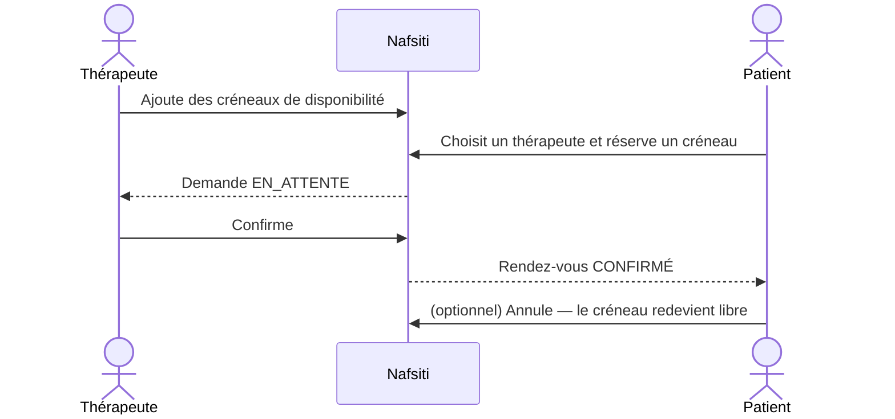

# NAFSITI — Plateforme de santé mentale

Nafsiti (« ma psyché ») met en relation **patients** et **thérapeutes** : prise de rendez-vous en ligne, suivi des séances et espace d'administration de la plateforme.

- **Backend** : API REST Spring Boot sécurisée par JWT — [`nefsiti_back/`](nefsiti_back)
- **Frontend** : application Angular — [`nafsiti_Front/angular/`](nafsiti_Front/angular)

---

## Fonctionnalités

### Disponibles

| Module | Fonctionnalité | Acteur |
|---|---|---|
| Authentification | Inscription (patient ou thérapeute), connexion, déconnexion (révocation du token) | Tous |
| Profil | Consulter / modifier son profil, changer son mot de passe | Tous |
| Utilisateurs | Lister, filtrer, créer, modifier, activer / désactiver, supprimer, statistiques | Administrateur |
| Disponibilités | Ajouter / supprimer ses créneaux | Thérapeute |
| Rendez-vous | Choisir un thérapeute et réserver un créneau libre | Patient |
| Rendez-vous | Confirmer une demande | Thérapeute |
| Rendez-vous | Annuler un rendez-vous (le créneau est libéré) | Patient, thérapeute, administrateur |
| Tableau de bord | Vue adaptée au rôle : prochaines séances, demandes à confirmer, graphiques, exercice de respiration | Tous |

### Prévues

Journal d'humeur et détection des signaux de détresse, ressources (méditation, respiration, articles), messagerie liée aux rendez-vous, notifications, réinitialisation du mot de passe, validation des thérapeutes.

---

## Stack technique

| Couche | Technologies |
|---|---|
| Backend | Java 17, Spring Boot 4.1, Spring Security (JWT stateless, BCrypt), Spring Data JPA / Hibernate, Bean Validation, Lombok |
| Base de données | PostgreSQL |
| Frontend | Angular 22 (composants standalone, signals), Bootstrap 5, ng-bootstrap, ApexCharts |

---

## Structure du projet

```
nafsiti/
├── nefsiti_back/                        # API Spring Boot
│   └── src/main/java/tn/esprit/pi/nefsiti/
│       ├── config/          # Création de l'administrateur initial
│       ├── controllers/     # Endpoints REST
│       ├── dto/             # Requêtes / réponses (records)
│       ├── entities/        # Utilisateur, Disponibilite, RendezVous, enums
│       ├── exceptions/      # Gestion centralisée des erreurs
│       ├── repositories/    # Spring Data JPA
│       ├── security/        # JWT, filtre, configuration Spring Security
│       └── services/        # Règles métier
└── nafsiti_Front/angular/               # Application Angular
    └── src/app/
        ├── core/            # Modèles, services HTTP, guards, intercepteur JWT
        ├── pages/           # Auth, profil, utilisateurs, rendez-vous, tableau de bord
        └── theme/           # Mise en page (menu, en-tête)
```

---

## Installation

### Prérequis

- **Java 17+** et Maven (le wrapper `mvnw` est fourni)
- **Node.js ≥ 22.22.3** (ou ≥ 24.15) et npm
- **PostgreSQL**

### 1. Base de données

Créer une base vide `nafsiti` ; les tables sont générées automatiquement au démarrage.

```sql
CREATE DATABASE nafsiti;
```

Ou avec Docker :

```bash
docker run -d --name nafsiti-db -e POSTGRES_DB=nafsiti -e POSTGRES_PASSWORD=postgres -p 5432:5432 postgres:16
```

### 2. Backend

```bash
cd nefsiti_back
cp src/main/resources/application-local.properties.example src/main/resources/application-local.properties
# puis renseigner l'URL, l'utilisateur et le mot de passe PostgreSQL, ainsi qu'une clé JWT
./mvnw spring-boot:run
```

L'API écoute sur `http://localhost:8080`.

`application-local.properties` n'est **pas versionné** : chacun y met ses propres identifiants. Les mêmes valeurs peuvent aussi être passées par variables d'environnement :

| Variable | Rôle | Valeur par défaut |
|---|---|---|
| `DB_URL` | URL JDBC | `jdbc:postgresql://localhost:5432/nafsiti` |
| `DB_USERNAME` / `DB_PASSWORD` | Identifiants PostgreSQL | `postgres` / `postgres` |
| `JWT_SECRET` | Clé HMAC en Base64 (≥ 256 bits) | clé de développement — **à changer** |
| `CORS_ORIGINS` | Origines autorisées (séparées par des virgules) | `http://localhost:4200` |
| `ADMIN_EMAIL` / `ADMIN_PASSWORD` | Administrateur créé au premier démarrage | `admin@nafsiti.tn` / `Admin2026` |

### 3. Frontend

```bash
cd nafsiti_Front/angular
npm install
npm start
```

L'application est disponible sur `http://localhost:4200`.

### Compte administrateur

Au premier démarrage, si aucun administrateur n'existe, le backend crée :

- **Email** : `admin@nafsiti.tn`
- **Mot de passe** : `Admin2026`

Pensez à changer ce mot de passe (page *Mon profil*) en dehors d'un environnement de développement.

---

## Rôles et parcours



| Rôle | Accès |
|---|---|
| **Patient** | Prendre un rendez-vous, suivre / annuler ses rendez-vous, profil |
| **Thérapeute** | Gérer ses disponibilités, confirmer / annuler ses rendez-vous, profil |
| **Administrateur** | Gestion des utilisateurs, vue et annulation de tous les rendez-vous |

L'inscription publique ne permet que les rôles Patient et Thérapeute ; seul un administrateur peut créer un autre administrateur.

---

## API REST

Toutes les routes sont préfixées par `/api`. Hors connexion et inscription, elles exigent l'en-tête `Authorization: Bearer <token>`.

### Authentification — `/api/auth`

| Méthode | Route | Accès | Description |
|---|---|---|---|
| POST | `/register` | Public | Inscription, renvoie un token |
| POST | `/login` | Public | Connexion, renvoie un token |
| POST | `/logout` | Connecté | Révoque le token courant |
| GET | `/me` | Connecté | Utilisateur connecté |

### Utilisateurs — `/api/utilisateurs`

| Méthode | Route | Accès | Description |
|---|---|---|---|
| PUT | `/me` | Connecté | Modifier son profil |
| PUT | `/me/mot-de-passe` | Connecté | Changer son mot de passe |
| GET | `/?recherche=&role=&actif=` | Admin | Lister / filtrer |
| GET | `/stats` | Admin | Statistiques |
| GET | `/{id}` | Admin | Détail |
| POST | `/` | Admin | Créer |
| PUT | `/{id}` | Admin | Modifier |
| PATCH | `/{id}/statut` | Admin | Activer / désactiver |
| DELETE | `/{id}` | Admin | Supprimer (avec ses rendez-vous et créneaux) |

### Disponibilités et rendez-vous

| Méthode | Route | Accès | Description |
|---|---|---|---|
| GET | `/api/disponibilites` | Thérapeute | Ses créneaux à venir |
| POST | `/api/disponibilites` | Thérapeute | Ajouter un créneau (`debut`, `dureeMinutes`) |
| DELETE | `/api/disponibilites/{id}` | Thérapeute | Supprimer un créneau non réservé |
| GET | `/api/therapeutes` | Connecté | Thérapeutes actifs et nombre de créneaux libres |
| GET | `/api/therapeutes/{id}/disponibilites` | Connecté | Créneaux libres d'un thérapeute |
| GET | `/api/rendez-vous` | Connecté | Les siens (patient / thérapeute) ou tous (admin) |
| POST | `/api/rendez-vous` | Patient | Réserver un créneau (`disponibiliteId`, `motif`) |
| PATCH | `/api/rendez-vous/{id}/confirmer` | Thérapeute | Confirmer une demande |
| PATCH | `/api/rendez-vous/{id}/annuler` | Concerné ou admin | Annuler et libérer le créneau |

Les erreurs sont renvoyées sous la forme :

```json
{ "status": 400, "message": "Données invalides", "erreurs": { "email": "Email invalide" } }
```

### Règles métier principales

- Mot de passe : au moins 8 caractères, dont une lettre et un chiffre ; stocké haché (BCrypt).
- Un compte désactivé ne peut plus se connecter, et ses tokens existants sont refusés immédiatement.
- Un créneau doit être dans le futur, durer de 15 min à 4 h et ne pas chevaucher un autre créneau du thérapeute.
- Un créneau réservé ne peut pas être supprimé ; deux réservations simultanées du même créneau sont impossibles (verrou optimiste).
- Un patient ne peut pas avoir deux rendez-vous qui se chevauchent ; un rendez-vous passé ne peut plus être confirmé ni annulé.
- Un administrateur ne peut ni se supprimer, ni se désactiver, ni retirer son propre rôle.

---

## Crédits

L'interface est construite à partir du template open source [Gradient Able (Angular)](https://github.com/codedthemes/gradient-able-free-admin-template) de CodedThemes, sous licence MIT (voir [`nafsiti_Front/LICENSE`](nafsiti_Front/LICENSE)).

Projet réalisé dans le cadre du module IA / Ingénierie logicielle — 5SAE9, ESPRIT.
